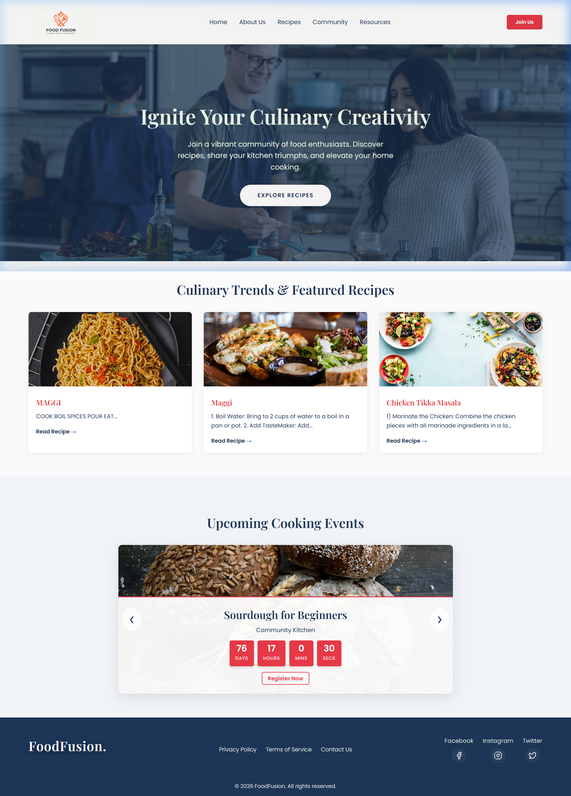
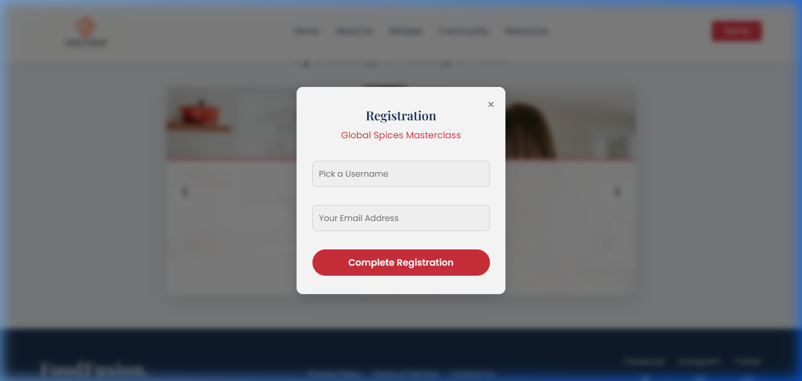
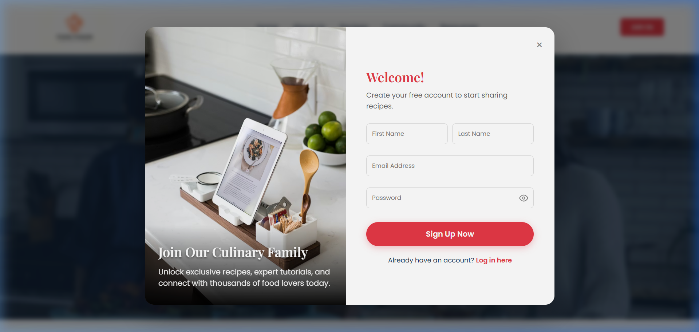
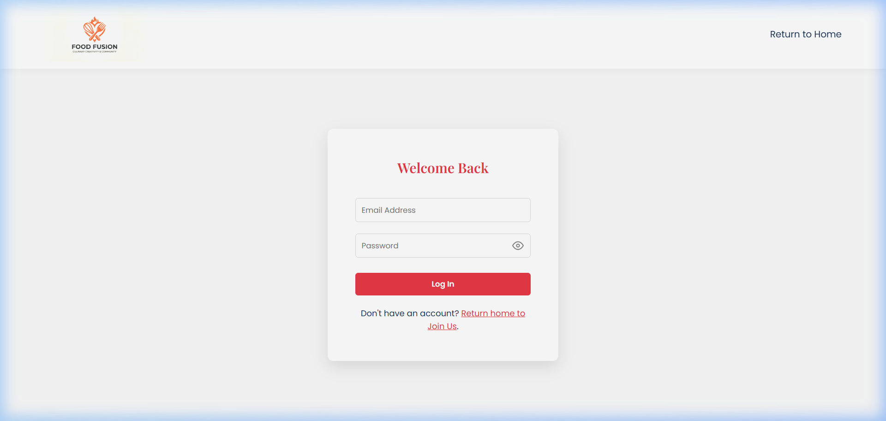
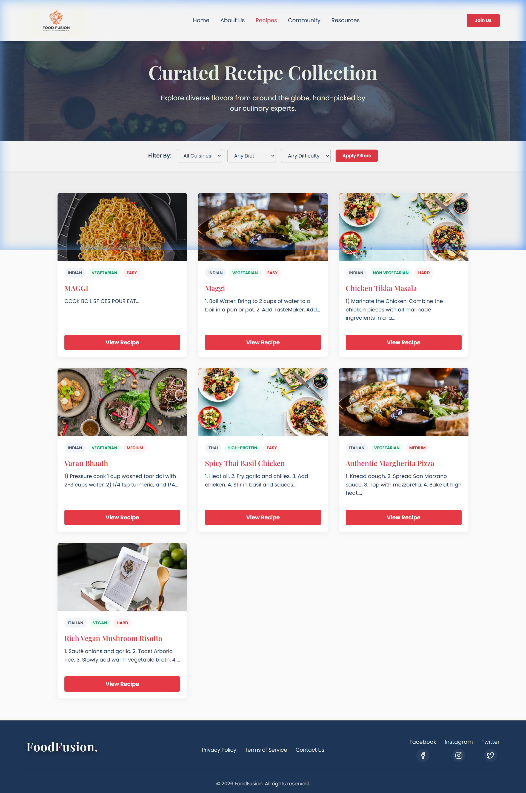
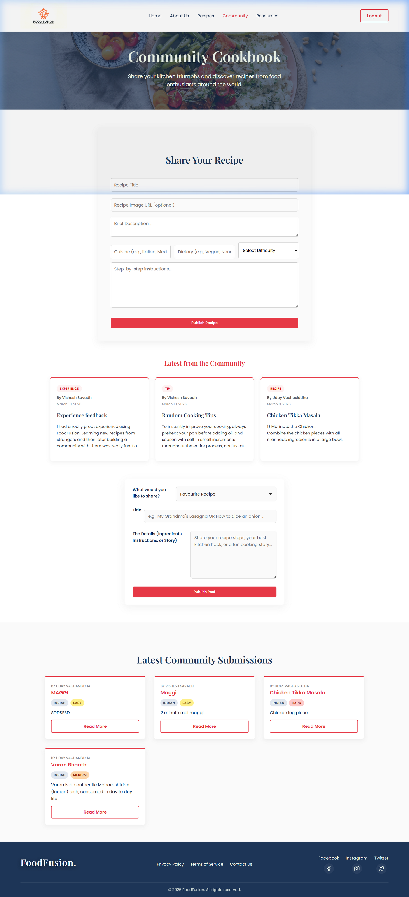
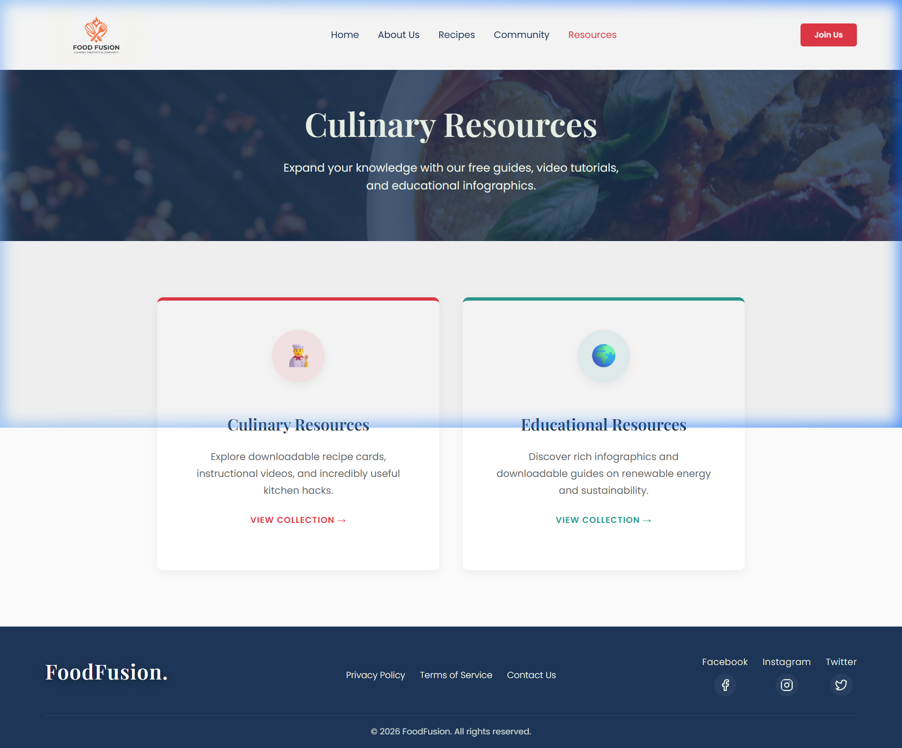
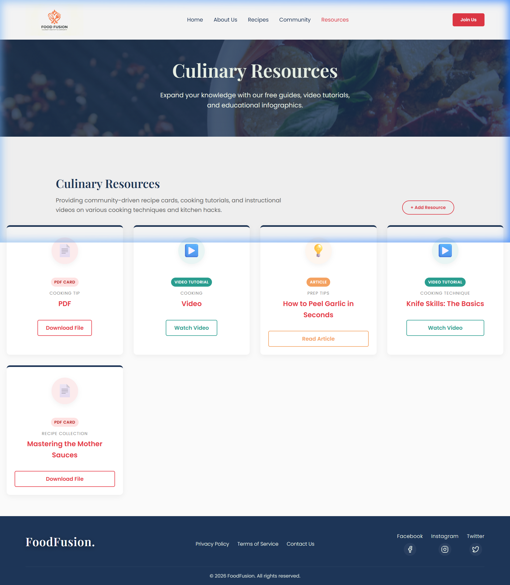
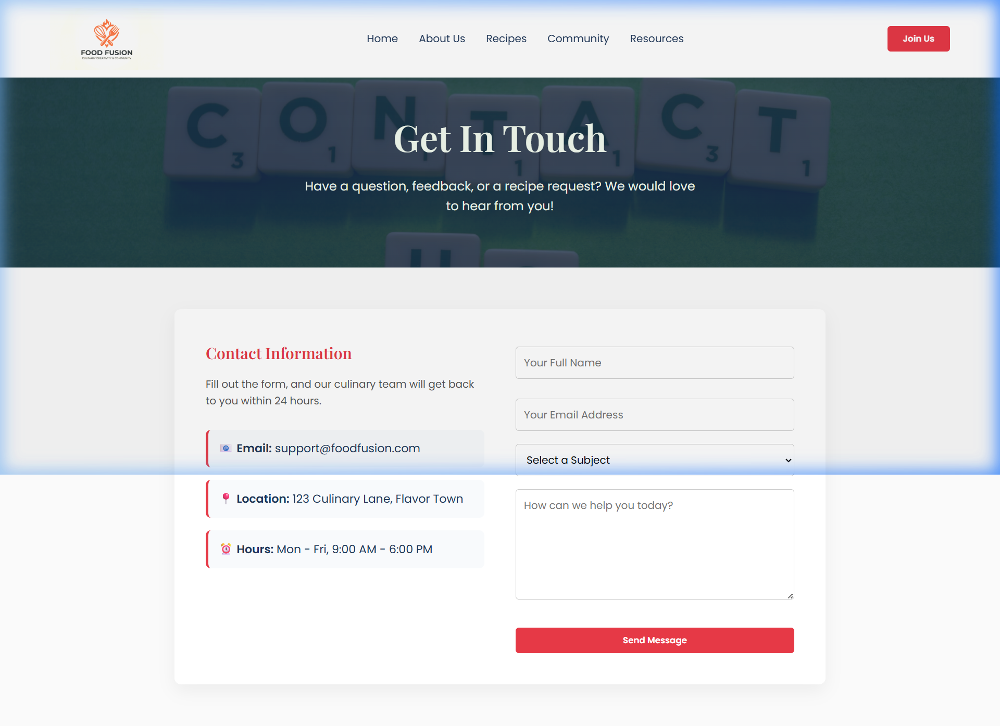
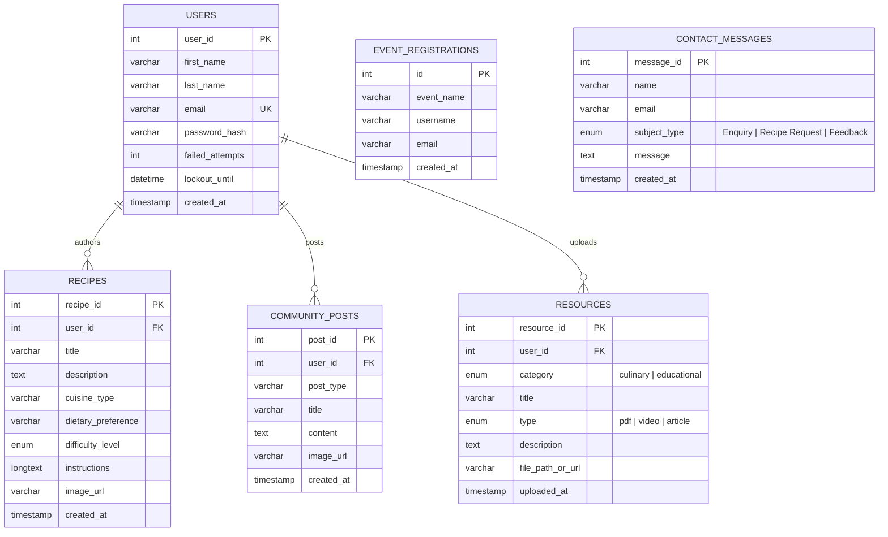

# 🍳 FoodFusion: Premium Culinary & Community Platform

FoodFusion is a secure, database-driven PHP web application designed to connect food enthusiasts, home cooks, and professional chefs. It provides a digital space for sharing gourmet recipes, cataloging educational and culinary resources, registering for hands-on cooking events, and collaborating through a dynamic community cookbook.

Built with a focus on security, dynamic rendering, and responsive design, the platform transitions gracefully between light and dark modes while incorporating self-healing database structures.

---

## 📸 Platform Showcase

### 1. Main Navigation & Landing Experience
| Homepage | Event Registration |
| :---: | :---: |
|  |  |
| *Featured recipe carousels, upcoming cooking workshops, and responsive navigation.* | *Interactive popup validation and registration forms for community events.* |

### 2. User Authentication & Community
| Member Registration | Member Login |
| :---: | :---: |
|  |  |
| *Bcrypt-secured signups checking password strength and duplicate accounts.* | *Secure login portal gating protected areas like recipe uploads.* |

### 3. Recipes & Interactive Catalog
| Database-Driven Catalog | Interactive Community Hub |
| :---: | :---: |
|  |  |
| *Filtered recipe grid featuring custom categories and fallback image renderers.* | *Full page layout showcasing live culinary posts and the dynamic recipe submission desk.* |

### 4. Educational & Practical Resources
| Categorized Resource Hub | Culinary Resource Guides |
| :---: | :---: |
|  |  |
| *Unified landing portal to access either culinary guides or educational materials.* | *Database-driven articles, video content links, and downloadable culinary manuals.* |

### 5. Secure Contact Portal
| Contact Us Page |
| :---: |
|  |
| *Protected communication forms for user inquiries, general feedback, and site issues.* |

---

## 🛠️ Key Features

- **Dynamic Recipe Catalog**: A search-and-filter recipes catalog loaded dynamically from a MySQL database. Features visual fallback mechanisms to handle missing or broken recipe image URLs.
- **Secure Authentication System**: User registration and login utilizing native PHP sessions. Guards administrative actions, restricting resource uploads and recipe submissions to registered users only.
- **Interactive Community Cookbook**: Live feed where logged-in members can share culinary recipes and text/image updates.
- **Dynamic Resource Hub**: Houses curated articles, nutritional files, video links, and download portals. Features a dynamic input switcher in the upload modal that swaps fields based on the chosen file type (e.g., file selector for PDFs vs. link field for YouTube videos).
- **Interactive Event Registration**: Registration modals allowing users to book spots in culinary workshops, instantly recording bookings to the database.
- **Self-Healing Schema Synchronization**: Defensive database integration that detects, auto-drops, updates, and seeds outdated MySQL table structures on demand.

---

## 📊 Database Architecture (ERD)

The relational schema is built on MySQL and contains six main tables that govern user actions, cookbook submissions, downloads, registrations, and feedback.



---

## 🔒 Security Implementations

Security controls are applied at each level of the data life cycle:

1. **SQL Injection Prevention (Prepared Statements)**:
   All database writes and queries use MySQLi prepared statements (`$conn->prepare()`) and strict parameter binding (`$stmt->bind_param()`). Raw user input is never parsed directly inside SQL strings.
2. **Cryptographic Hashing (BCrypt)**:
   Passwords are never stored as plain text. FoodFusion processes passwords using PHP’s native `password_hash()` with `PASSWORD_DEFAULT` (Bcrypt), generating cryptographically strong, salted hashes. Verification uses `password_verify()`.
3. **Cross-Site Scripting (XSS) Sanitization**:
   All user-generated strings, comments, and titles printed back to the browser are encoded using `htmlspecialchars()`. Dynamic scripting tags (e.g., `<script>`) render safely as static plain text.
4. **Session Authentication & Access Gatekeeping**:
   PHP sessions (`$_SESSION`) verify identity before processing operations. Unauthenticated requests targeting protected routes (like `submit_recipe.php` or `submit_resource.php`) are intercepted and blocked or redirected on the server side.

---

## 🚀 Installation & Local Setup

FoodFusion is developed for local Apache web servers with PHP and MySQL support (such as **XAMPP**, **WAMP**, or **MAMP**).

### Prerequisites
- **PHP**: Version 8.0 or higher is recommended.
- **MySQL / MariaDB**: Version 5.7 or higher.
- **Web Server**: Apache.

### Step-by-Step Installation

1. **Clone the Repository**:
   Clone this repository directly into your web server's public root directory (e.g., `C:/xampp/htdocs/` for XAMPP):
   ```bash
   cd C:/xampp/htdocs
   git clone https://github.com/your-username/Food-Fusion.git
   ```

2. **Configure the Database**:
   - Start Apache and MySQL via your local server control panel (XAMPP Control Panel).
   - Navigate to **phpMyAdmin** (`http://localhost/phpmyadmin/`).
   - Create a new database named `foodfusion`:
     ```sql
     CREATE DATABASE foodfusion;
     ```
   - Import the structural file [foodfusion.sql](file:///c:/Users/Uday/Downloads/Food-Fusion/foodfusion.sql) into your database.
   - Run the [submit_post table created.sql](file:///c:/Users/Uday/Downloads/Food-Fusion/submit_post%20table%20created.sql) file inside the SQL tab to append the community posts schema.

3. **Establish DB Credentials**:
   Open [db_connect.php](file:///c:/Users/Uday/Downloads/Food-Fusion/db_connect.php) and configure the credentials to match your local setup:
   ```php
   $host = "localhost"; 
   $username = "root";      
   $password = "YOUR_DATABASE_PASSWORD"; // Default is often "" (blank)
   $dbname = "foodfusion";
   ```

4. **Setup Email Notifications (Optional)**:
   Open [config.php](file:///c:/Users/Uday/Downloads/Food-Fusion/config.php) to update SMTP configurations for contact form forwarding (Gmail requires a [Google App Password](https://support.google.com/accounts/answer/185833)):
   ```php
   define('SMTP_HOST', 'smtp.gmail.com');
   define('SMTP_PORT', 587);
   define('SMTP_USER', 'your-email@gmail.com');
   define('SMTP_PASS', 'your-16-char-app-password');
   define('SMTP_FROM', 'support@foodfusion.com');
   ```

5. **Start Cooking!**:
   Launch your web browser and open:
   `http://localhost/Food-Fusion/index.php`

---

## 🛠️ Code Architecture & Self-Healing Migration

One of FoodFusion's most robust features is the **Self-Healing Schema Synchronization** embedded within the database driver. If the application detects that the table columns in your local database do not match updates in the code, it automatically drops the outdated structures, reconstructs the tables, and seeds them with clean mock datasets.

```php
// Verification logic from db_connect.php
$colCheck = $conn->query("SHOW COLUMNS FROM resources LIKE 'file_path_or_url'");
if ($colCheck && $colCheck->num_rows == 0) {
    // Schema mismatch detected! Drop and rebuild the resource table
    $conn->query("DROP TABLE IF EXISTS resources");
    $conn->query("CREATE TABLE resources (
        resource_id INT(11) AUTO_INCREMENT PRIMARY KEY,
        category ENUM('culinary', 'educational') NOT NULL,
        title VARCHAR(255) NOT NULL,
        type ENUM('pdf', 'video', 'article') NOT NULL,
        description TEXT,
        file_path_or_url VARCHAR(255) NOT NULL,
        user_id INT(11) DEFAULT NULL,
        uploaded_at TIMESTAMP DEFAULT CURRENT_TIMESTAMP
    )");
    
    // Seed initial download data
    $conn->query("INSERT INTO resources (...) VALUES (...)");
}
```

---

## 📂 Project Directory Structure

```text
Food-Fusion/
│
├── assets/                 # Global media assets & logos
│   └── logo.png
│
├── screenshots/            # UI screenshots referenced in README
│   ├── homepage.png
│   ├── community_hub.png
│   └── ...
│
├── downloads/              # PDF and media files available for download
│   ├── food_safety.pdf
│   └── mother_sauces.pdf
│
├── libs/                   # Third-party dependencies (PHPMailer, etc.)
│
├── db_connect.php          # Database setup & connection instance
├── config.php              # Global site definitions and SMTP keys
├── style.css               # Main styling rules sheet
├── main.js                 # Global JavaScript UI interactions
│
# Public Application Pages
├── index.php               # Homepage
├── about.php               # About Us section
├── contact.php             # Contact form
├── login.php               # User authentication desk
├── logout.php              # Session removal page
├── recipes.php             # Main recipes listing page
├── view_recipe.php         # Singular detailed recipe inspector
├── community.php           # Cookbook and public forum
├── resources.php           # Resource center landing hub
├── resources_culinary.php  # Filtered culinary resources
└── resources_educational.php# Filtered educational resources
```

---


