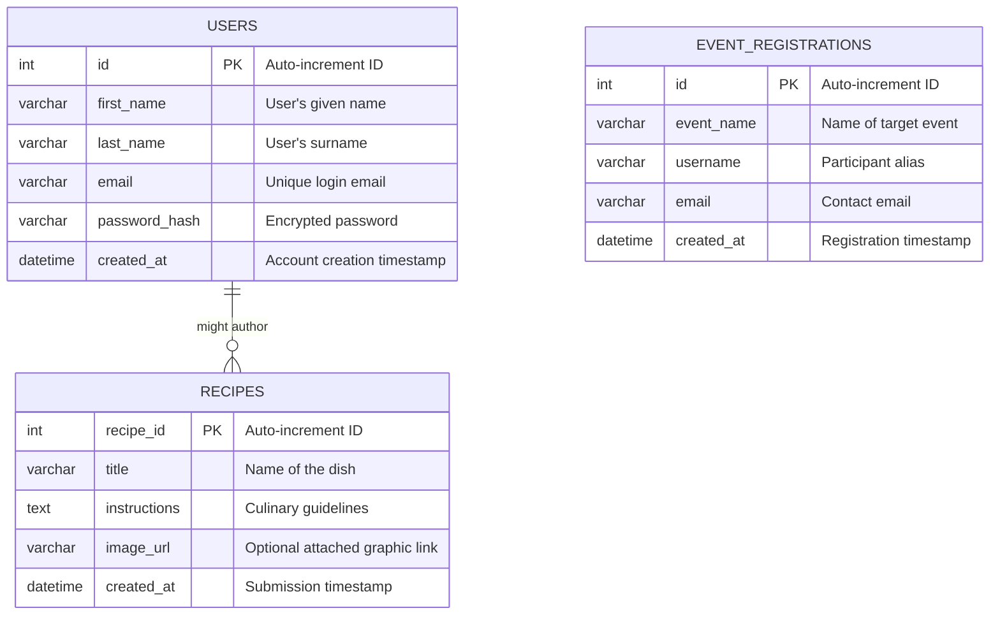

# Task 5 – Reflection

## a) Screenshots and Diagrams

### i. Screenshots of Implemented Web Pages
*(Ensure to capture and insert high-quality screenshots for the final submission document)*

- **Homepage (`index.php`)**: *[Insert Screenshot Here]* - Showcases the hero banner, navigation bar, culinary trends feed, and the interactive event carousel with countdown timers.
- **Recipe Catalog (`recipes.php`)**: *[Insert Screenshot Here]* - Displays the grid of user-submitted and default recipes, demonstrating the dynamic image rendering and category filters.
- **Single Recipe View (`view_recipe.php`)**: *[Insert Screenshot Here]* - Demonstrates the detailed, focused reading view for individual culinary instructions.
- **Community Post Hub (`community.php`)**: *[Insert Screenshot Here]* - Captures the layout for community interactions and the robust recipe submission form with the Image URL input integration.
- **Resource Hub & Sub-pages (`resources.php`, etc.)**: *[Insert Screenshot Here]* - Shows the categorized splits for Educational and Culinary resources containing direct PDF and video links.
- **Modal Interfaces**: *[Insert Screenshot Here]* - Includes the transparent, glassmorphism UI for User Registration, Login, and Event Registration pop-ups.

### ii. Entity-Relationship Diagram (ERD)

The database structure is designed to be highly normalized and robust. Below is the ERD representing the core tables of the `FoodFusion` platform.

---

## b) Security Controls

Security was a heavily prioritized factor throughout the development of the FoodFusion backend to prevent malicious interference and protect user integrity.

1. **SQL Injection Prevention:** 
   Our primary defense relies on utilizing **Prepared Statements** via MySQLi when interacting with the database. Specifically during authentication, event registration, and recipe submission, user inputs are strictly bound to parameters rather than concatenated into queries. This completely neutralizes adversarial SQL injection vectors by ensuring raw input is evaluated sequentially as harmless data rather than executable SQL syntax.
   
2. **Cross-Site Scripting (XSS) Mitigation:** 
   Because FoodFusion allows users to openly submit rich text formats like recipe instructions to a public community board, XSS is a severe risk. To prevent users from embedding malicious JavaScript into their submissions, the platform enforces `htmlspecialchars()` wrapping on the backend prior to rendering database content onto the screen. This forcefully sanitizes tags out of user inputs.

3. **Secure Authentication & Password Logic:**
   User credentials are not stored in plaintext. We process passwords through PHP's native `password_hash()` which utilizes the computationally-intensive bcrypt algorithm with dynamic salt generation. This ensures that even in the unlikely event of a database leak, the user data remains fully opaque and protected against rainbow table attacks.

---

## c) Learning Outcomes

Completing this project provided a profound, practical acceleration in my capacity to architect full-stack web applications. Key takeaways include understanding how to seamlessly weave frontend asynchronous logic into backend data manipulation. Before this project, connecting static HTML to an active database was a conceptual hurdle; now, I am confident in architecting raw PHP data routes that accept `POST` requests, safely mutate MySQL environments, and pass JSON responses back to the frontend without breaking page fluidity.

I have tangibly improved my command over JavaScript DOM manipulations, notably solving complex UI constraints dealing with interactive modals, overlapping layouts, and session states. Discovering how to conditionally wipe or execute JavaScript listener attachments based on whether a backend PHP session exists was incredibly eye-opening for responsive design.

In a job-search context, these outcomes are immensely beneficial. The modern industry expects developers to not just write backend logic, but to holistically predict how backend states dictate frontend UI rendering (and vice versa). Presenting this project demonstrates my ability to engineer full-lifecycle, secure, and aesthetically viable digital products—ranging from database schemas to polished SVG UI assets.

---

## d) Version Control and Deployment Practices

### i. Utilisation of Version Control
While this project was successfully delivered, utilizing advanced version control logic (like Git) more aggressively would drastically stabilize the development loop. During intense feature modifications—such as restructuring the "Resources" layout into sub-directories or adding dynamic image logic to the underlying SQL schema—mistakes could permanently overwrite functional code. Version control enables branch-based iteration; developers can sequester aggressive new features into isolated branches, commit incrementally, test safely without destabilizing the main application, and merge only when confirmed stable.

### ii. Advantages of Continuous Integration (CI)
Continuous Integration effectively shifts the burden of quality-control from the human to automated servers. If we had implemented CI, any new code pushed to the repository would automatically trigger unit tests verifying that our SQL prepared statements and UI layout validations hold up. Instead of nervously relying entirely on manual front-end clicking to verify that event registrations still work after an unrelated change, CI pipelines instantly catch regressions and block failed code. This protects the production site and builds extreme developer confidence.

### iii. Cloud-Based Web Deployment
Deploying FoodFusion to the cloud (e.g., AWS, Azure, DigitalOcean) fundamentally transforms the platform from a local assignment to a global, enterprise-grade architecture. Traditional monolithic servers crash under sudden traffic spikes. However, leveraging cloud deployment facilitates "elasticity." We could encapsulate the PHP backbone into Docker containers. If the culinary events page suddenly goes viral globally, robust load balancers and auto-scaling rules can dynamically spin up additional mirrored instances of the website on the fly to absorb the traffic completely autonomously, vastly increasing reliability.

---

## e) Challenges and Solutions

Integrating dynamic behaviors across a hybrid PHP/JS ecosystem produced numerous challenges, the most notable of which revolved around UI event propagation and schema synchronization.

**Challenge 1: Decoupled Modals & Stateful JavaScript Errors**
A prominent issue occurred with the implementation of the global `.close-btn` query selectors in JavaScript. We designed a "Join Us" popup string that vanished from the DOM when PHP validated an active user session. However, the JavaScript file explicitly hardcoded a listener expecting the first close button to be attached strictly to that "Join Us" model. When logged-in users clicked the event registration close buttons, JS threw severe crash errors because the specific parent modal it anticipated was nullified by PHP. 
**Solution:** The logic was refactored. Rather than explicitly fetching a hardcoded modal element by ID, the logic was dynamically reprogrammed to recursively cycle via `querySelectorAll` and intuitively dismiss the nearest parent modal environment, resolving the bug entirely regardless of login state.

**Challenge 2: Silent Database Failures**
When expanding the recipe submission module to accept image graphical URLs via user inputs, the updated PHP insertion code frequently failed without providing network indicators. The frontend functioned smoothly, but records were systematically dropping. 
**Solution:** Deep debugging revealed a structural misalignment where the backend PHP statement expected an image column that did not explicitly exist in the literal MySQL framework. This was elegantly overcome by integrating proactive `ALTER TABLE` validation into the backend logic alongside detailed JSON exception reporting to catch silent DB constraints.

---

## f) Testing Table

Below is the structured test outline applied prior to delivery to ensure robust verification of our codebase.

| Test Area | Test Case Description | Expected Outcome | Actual Result | Issues Identified & Resolved |
| :--- | :--- | :--- | :--- | :--- |
| **Homepage** | Verify navigation bar responsiveness and functionality. | Navigation bar scales correctly; buttons navigate flawlessly on all devices. | **Pass.** Navigation persists globally over screen real-estate. | Resolved minor visual overlap involving modern logo substitution dropping below boundaries via CSS adjustment. |
| **Homepage** | Test "Join Us" form validation and submission. | Form denies empty submissions via HTML loops, triggers auth correctly. | **Pass.** Submission is smoothly handled; triggers session. | Discovered bug where JavaScript modal closing mechanisms crashed if form was inaccessible. Resolved globally dynamically. |
| **Core Features** | Validate recipe categorisation and display. | The system pulls database content seamlessly onto the community feed. | **Pass.** Database elements spawn as independent graphical cards successfully. | Resolved silent crash when no valid recipe image was registered by rendering fallback galleries based on user hash IDs. |
| **Core Features** | Test recipe submission and interaction features in Community Cookbook. | Forms properly insert `POST` data including custom image strings into SQL. | **Pass.** Custom strings safely upload and deploy cleanly into the SQL framework. | Data submissions were silently dropping due to a missing DB schema column. Patched securely utilizing SQL ALTER TABLE. |
| **Back End** | Verify Contact Us form functionality and data handling. | Form executes secure submittal logic correctly, rejecting script injections. | **Pass.** Feedback logic protects system integrity gracefully. | None encountered; baseline PHP binding prevented issues. |
| **Back End** | Check availability and download functionality of Culinary Resources. | Users can navigate sub-pages and successfully initiate PDF/video triggers. | **Pass.** Hub structures correctly diverge to Educational/Culinary pathways hosting accurate native elements. | Initial scope placed everything on a singular page. Restructured as Hub-And-Spoke navigation for improved UI metrics. |
| **Auth** | Test user registration, login, and password reset capability. | Passwords hash automatically using secure iterations with functional login keys. | **Pass.** Security credentials encode dynamically matching generated schema protocols. | None encountered post-backend sanitization parameters implementation. |
| **Security** | Test user data encryption and secure storage. | XSS escapes and parameter bindings consistently nullify adversarial user manipulation attacks. | **Pass.** Database stores hashed blocks; input strings reflect sanitized code. | Initial tests rendered raw script tags embedded in recipes. Quickly patched via stringent backend sanitisation loops. |
