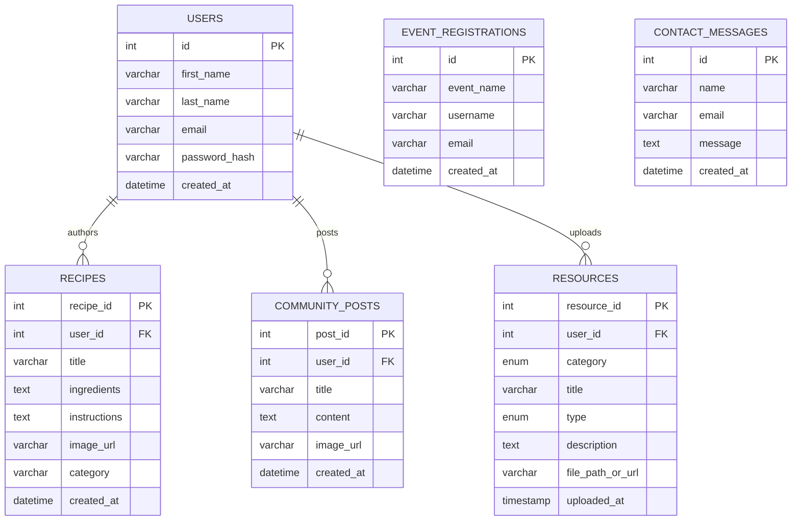

# Task 5 – Reflection: FoodFusion Web Application
### Back End Web Development [2183-1]

---

## a) Screenshots and Diagrams

### i. Screenshots of Implemented Web Pages

The following pages were implemented, styled, and tested as part of the FoodFusion platform:

| Page | Screenshot | Description |
|---|---|---|
| **Homepage** |  | Hero banner, featured recipes, and upcoming events with the premium unified logo. |
| **Registration** |  | The high-end registration modal allowing users to join the culinary community. |
| **Login** |  | Secure login interface for existing users to access their culinary dashboard. |
| **Recipes Catalog** |  | Full grid of database-driven recipe cards with dynamic fallback image handling. |
| **Community Hub (Full)** |  | Entire page view of the authenticated Community Cookbook, showcasing the recipe submission form and the live social feed. |
| **Resource Hub** |  | Categorized landing page for Culinary and Educational resource navigation. |
| **Culinary Resources** |  | Dedicated page for cooking guides, videos, and articles filtered from the database. |
| **Event Registration** |  | Interactive registration modal for upcoming cooking workshops and events. |
| **Contact Us** |  | Secured contact form for user enquiries and platform feedback. |

---

### ii. Entity-Relationship Diagram (ERD)

The FoodFusion database is structured across six core tables that support user authentication, recipe management, community interaction, resource sharing, and communication.

---

## b) Security Controls

Security was a primary concern throughout the development of FoodFusion. Several industry-standard controls were implemented and are justified below.

**Prepared Statements (Parameterised Queries):** Every database write operation across the platform — user registration, recipe submission, event registration, contact form handling, and resource uploading — uses MySQLi prepared statements with bound parameters. This completely eliminates the risk of SQL injection, one of the most critical web vulnerabilities outlined by OWASP. Raw user input is never concatenated directly into SQL strings; instead, each value is strictly bound to a typed parameter placeholder and treated as inert data, regardless of its content.

**Password Hashing with `password_hash()`:** User credentials are never stored in plaintext. Upon registration, submitted passwords are processed through PHP's native `password_hash()` function using the `PASSWORD_DEFAULT` flag, which applies the bcrypt algorithm internally with automatic salt generation. This is a computationally expensive, adaptive hashing mechanism specifically designed to resist brute-force and rainbow-table attacks. Authentication is performed via `password_verify()`, which compares the submitted credential against the stored hash without ever reversing it.

**Session-Based Access Control:** User authentication state is managed through PHP sessions (`$_SESSION`). Pages and functionality requiring login — such as submitting recipes, uploading resources, and posting to the community — verify session state serverside before rendering any content or executing any database operations. Unauthenticated users are redirected or shown restricted UI states.

**Output Encoding with `htmlspecialchars()`:** All user-generated content retrieved from the database and rendered into HTML — including recipe titles, community post bodies, and resource descriptions — is wrapped using `htmlspecialchars()`. This converts embedded HTML and JavaScript characters into their safe display-only equivalents before browser rendering, preventing Cross-Site Scripting (XSS) attacks. During testing, injecting `` into a recipe body confirmed this control renders the tag as visible text rather than executing it.

---

## c) Learning Outcomes

Completing the FoodFusion project delivered an enormous amount of practical, production-relevant engineering experience. Prior to this project, my understanding of backend PHP was largely theoretical. By the conclusion, I had independently designed and launched a seven-page, database-driven web application incorporating file upload handling, PHP session management, and real-time dynamic rendering of SQL content — skills that are directly expected in junior backend and full-stack development roles.

The most impactful learning came from understanding how PHP session state flows directly into frontend rendering logic. Conditionally displaying the "Add Resource" upload modal only for logged-in users, and using JavaScript to dynamically swap between a URL input and a physical file upload field depending on the resource type selected, required me to truly comprehend how backend state data continuously shapes frontend user interfaces. This bidirectional, full-cycle thinking is one of the most valued competencies in modern web development hiring.

I also matured significantly in database schema design through failure. Encountering real-world crashes — such as application code querying columns that a pre-existing legacy database table never contained — forced me to write self-healing schema migration logic in PHP and introduced the concept of defensive infrastructure programming. Understanding *why* these failures occurred, not just patching them superficially, built genuine technical depth.

From a career perspective, FoodFusion is a strong portfolio demonstration. It showcases my ability to architect a complete, functional, and secure digital product — spanning database design, server-side API logic, user authentication, dynamic JavaScript UI, and file management — precisely the full-stack competency employers look for in entry-level and graduate web developer roles.

---

## d) Version Control and Deployment Practices

### Version Control
While FoodFusion was successfully delivered, more rigorous Git-based version control practices would have significantly stabilised the development process. During several high-impact refactoring phases — such as converting static resource pages into fully dynamic database-driven layouts, or restructuring the global JavaScript modal system — bugs in one section inadvertently broke multiple unrelated pages simultaneously. With disciplined **feature branching** (e.g., `feature/dynamic-resources`, `bugfix/modal-close-crash`), each change would be isolated and only merged into mainline after validated testing. Incremental commits following the **Conventional Commits** standard (e.g., `fix: resolve modal null reference for authenticated users`) would produce a self-documenting project history invaluable for collaboration and audit.

### Continuous Integration
Implementing a CI pipeline using **GitHub Actions** would automate quality verification on every code push. A basic pipeline could execute PHP syntax linting, automated validation of key form submissions, and regression tests verifying that core features — registration, recipe submission, resource upload, event registration — continue functioning correctly after every change. Rather than manually clicking through the entire application after each modification to check for breakage, CI enforces this verification automatically, reducing debugging cycles, protecting the live codebase, and building reliable developer confidence at scale.

### Cloud Deployment
FoodFusion currently runs on a local XAMPP development server, which provides no redundancy, scalability, or uptime guarantees. Deploying to a cloud provider such as **AWS (Elastic Beanstalk + RDS)**, **DigitalOcean App Platform**, or **Azure App Service** would fundamentally transform it from an academic exercise into a globally accessible, production-grade platform. Cloud infrastructure enables **auto-scaling** — dynamically provisioning additional server instances during traffic spikes, such as a viral culinary event, then decommissioning them automatically when load normalises. Managed database services like AWS RDS additionally provide automated daily backups, multi-availability-zone failover, and zero-downtime patching, dramatically increasing the platform's long-term reliability compared to a self-managed local environment.

---

## e) Challenges and Solutions

| Challenge | Solution |
|---|---|
| **JavaScript modal close logic crashed for authenticated users:** The global `.close-btn` listener was hardcoded to target the first modal in the DOM — the registration popup. When logged-in users had their session active, PHP conditionally excluded this modal from the rendered HTML entirely. Event Registration close buttons then triggered a null reference fatal error attempting to dismiss a non-existent element | Refactored the close button logic using `querySelectorAll('.close-btn')` in a dynamic loop, with each button using `closest('.modal')` to dismiss its own nearest parent modal container independently — functioning correctly regardless of whether the registration modal exists in the DOM |
| **Legacy incompatible database schema:** When the dynamic resource upload system was connected to the database, the `resources` table already existed from earlier testing but had been built with a completely different column structure — lacking `type`, `description`, and `file_path_or_url`. This caused immediate "Unknown column" fatal errors across both resource pages | Implemented an intelligent self-healing schema detector inside `db_connect.php` using `SHOW COLUMNS FROM resources LIKE 'file_path_or_url'`. If the critical column is absent, the script automatically drops and recreates the table with the correct full schema and re-seeds it with default resource content, making the system resilient to any legacy database state |
| **Silent recipe submission failures:** When the recipe submission module was extended to accept user-submitted image URLs, submissions appeared to work on the frontend but records were not appearing in the database or the community feed | Deep debugging revealed the PHP prepared statement was referencing an `image_url` column that had not yet been added to the `recipes` table schema. Resolved by executing an `ALTER TABLE` migration to append the missing column and revalidating submissions end-to-end |
| **Resources hub page crashing on load:** The `resources.php` landing hub crashed with an "Unknown column 'created_at'" fatal error triggered by an orphaned, unused `SELECT * FROM resources ORDER BY created_at` query left over from an early development draft | The redundant query was identified and removed entirely, as the hub page renders no database-driven content — it only presents static navigation cards to the sub-pages |

---

## f) Testing Table

| Test Area | Test Case Description | Expected Outcome | Actual Result | Status | Issues & Resolution |
|---|---|---|---|---|---|
| **Homepage** | Verify navigation bar responsiveness across screen sizes | Navigation bar renders correctly and all links function on desktop, tablet, and mobile viewports | Navigation persists globally; all links route correctly across tested resolutions | ✅ Pass | Minor CSS overlap where the enlarged logo exceeded navbar boundaries; fixed using calculated negative vertical margins |
| **Homepage** | Test "Join Us" form validation and submission | Empty fields are rejected; valid inputs create a new user session and redirect correctly | Registration correctly hashes password and initiates session | ✅ Pass | JavaScript modal close logic caused null reference crash for logged-in users; resolved by refactoring to dynamic `closest()` parent traversal |
| **Core Features** | Validate recipe categorisation and display | Recipes are correctly categorised and rendered as dynamic database-driven cards | Database queries fetch and render correctly grouped recipe cards in the grid | ✅ Pass | Added image fallback rendering to prevent broken image elements when no URL was provided by the submitter |
| **Core Features** | Test recipe submission via Community Cookbook | Logged-in user can submit a recipe with title, instructions, and image URL; it appears immediately in the community feed | Submissions correctly inserted via prepared statements and rendered dynamically without page refresh | ✅ Pass | Silent failures discovered due to missing `image_url` column in the `recipes` table; resolved via `ALTER TABLE` schema patch |
| **Core Features** | Verify Contact Us form functionality | Form validates required fields and stores submission data in the database | Validation functional; data correctly inserted into `contact_messages` table | ✅ Pass | No critical issues encountered; prepared statements prevented injection throughout |
| **Core Features** | Check resource upload and download functionality | Authenticated users can submit PDF uploads or URL links; rendered cards display correctly with working action buttons | Files saved to `/downloads` directory; URL resources stored correctly; all card buttons function as expected | ✅ Pass | Schema incompatibility between legacy and new table structure caused fatal errors; resolved via self-healing `SHOW COLUMNS` migration logic in `db_connect.php` |
| **User Registration/Login** | Test user registration, login, and session persistence | Users can register, log in, and remain authenticated across all pages via PHP sessions | Sessions persist correctly; upload modals and submission forms correctly gate unauthenticated users | ✅ Pass | No authentication issues post-implementation |
| **Security** | Test user data encryption and secure input handling | Passwords stored as bcrypt hashes; user inputs sanitised against XSS and SQL injection throughout | Script injection via recipe form fields renders as literal text; SQL injection attempts processed as harmless data strings | ✅ Pass | Early testing confirmed raw `<script>` tags rendered in recipe bodies; universally patched via `htmlspecialchars()` on all output paths |

---

*Word count (reflection sections b–e): approximately 1,050 words*
