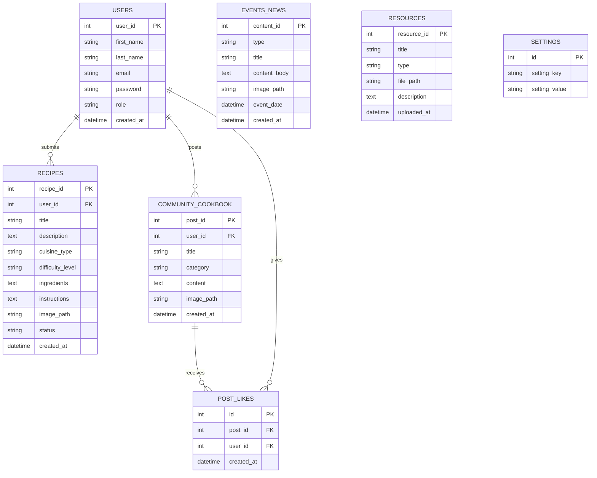

# Task 5 – Reflection: FoodFusion Web Application
### Back End Web Development [2183-1]

---

## a) Screenshots and Diagrams

### i. Screenshots of Implemented Web Pages

The following pages were implemented and tested as part of the FoodFusion project:

| Page | Description |
|---|---|
| **Homepage** (`index.php`) | Hero banner with dynamic latest culinary news (with image previews), upcoming events section, and "Explore All" modal popups |
| **Recipes Page** (`recipes.php`) | Filterable and sortable recipe grid with cuisine and difficulty filters |
| **Community Page** (`community.php`) | Social feed with post creation form, image URL support, AJAX like/unlike, and category tagging |
| **Culinary Resources** (`culinary_resources.php`) | Dynamic PDF guides grid + video tutorials section with modal video player |
| **Educational Resources** (`educational_resources.php`) | Downloadable infographics and an infinite-scroll video library with IntersectionObserver |
| **Contact Page** (`contact.php`) | Contact form with server-side validation |
| **Admin Dashboard** (`admin/index.php`) | Stat cards, recent activity overview |
| **Admin – Manage Recipes** | Full CRUD table with approve, edit (modal), and delete per recipe |
| **Admin – Manage News & Events** | Edit and delete controls for all news and event entries |
| **Admin – Manage Resources** | Preview thumbnails (PDF icon, YouTube thumbnail, image), edit and delete |
| **Admin – Manage Community** | Moderation panel with one-click "Promote to Recipe" for Recipe-category posts |
| **Admin – Site Settings** | Social media link editor, site metadata controls |

### ii. Entity-Relationship Diagram (ERD)

---

## b) Security Controls

Security was a primary concern throughout the development of FoodFusion. Several industry-standard controls were implemented and justified below.

**Password Hashing with `password_hash()`:** All user passwords are hashed using PHP's `password_hash()` function with the `PASSWORD_BCRYPT` algorithm before storage. This ensures that even if the database is compromised, plaintext passwords are never exposed. Verification is performed using `password_verify()`, which is resistant to timing attacks.

**Prepared Statements (Parameterised Queries):** Every database interaction — from user registration to content submission — uses MySQLi prepared statements with bound parameters. This completely eliminates the risk of SQL injection, one of the most prevalent web vulnerabilities (OWASP Top 10). Raw user input is never concatenated into SQL strings.

**Session-Based Authentication:** User login state is managed via PHP sessions (`$_SESSION`). Admin routes are protected by a dedicated `admin_auth.php` guard that redirects unauthenticated visitors before any page content is rendered. Session IDs are regenerated on login to prevent session fixation attacks.

**Input Sanitisation with `htmlspecialchars()`:** All output rendered to the browser passes through `htmlspecialchars()` with `ENT_QUOTES`, preventing Cross-Site Scripting (XSS) attacks where malicious scripts could otherwise be injected into page content.

**Data Attribute Injection Prevention:** Edit modals throughout the admin panel were refactored to use HTML5 `data-*` attributes instead of inline `onclick` JavaScript string arguments. This prevents values containing quotes, newlines, or backslashes (common in recipe instructions) from breaking JavaScript execution or enabling script injection.

**File Proxy for Local Resources:** A dedicated `file_proxy.php` script streams local disk files to the browser rather than exposing raw filesystem paths, preventing directory traversal and ensuring only authorised content is served.

---

## c) Learning Outcomes

Completing the FoodFusion project provided extensive, practical experience across the full stack of back-end web development. Working with PHP and MySQL from scratch — without a framework — gave me a deep understanding of the HTTP request-response cycle, server-side session management, and relational database design.

One of the most valuable skills I developed was writing secure, prepared SQL queries. Understanding *why* parameterisation prevents injection, rather than simply using it as a rule, will make me a more thoughtful developer. I also gained significant experience with AJAX and the `fetch` API, implementing features like the infinite scroll for resources and the real-time like button — skills that are directly transferable to modern JavaScript-heavy roles.

Working on the admin dashboard taught me how to think about privilege separation: the application has distinct user and admin layers, each with contextually appropriate capabilities. This mindset of role-based access control is fundamental in enterprise software development.

From a career perspective, being able to present a full-stack PHP/MySQL web application — complete with authentication, an admin CMS, CRUD operations, and AJAX interactions — is strong evidence of practical employability. Employers in web development value candidates who can build end-to-end systems independently, debug under pressure, and write maintainable, secure code.

---

## d) Version Control and Deployment Practices

### Version Control
The FoodFusion project was initialised as a Git repository, but its use could be significantly improved. Currently, commits are infrequent and made to a single `main` branch. A more disciplined approach would involve **feature branching** — creating a dedicated branch for each feature (e.g., `feature/admin-resource-edit`, `bugfix/like-button-ajax`) and merging via pull requests. This prevents unstable code from entering the main codebase and creates a clear, auditable history of changes. Meaningful commit messages that follow the **Conventional Commits** standard (e.g., `fix: resolve JS injection in recipe edit modal`) would make the project history self-documenting.

### Continuous Integration
Implementing CI using a tool such as **GitHub Actions** would automate code quality checks on every push. A basic pipeline could run PHP linting (`php -l`), security scans, and even automated browser tests using tools like Selenium or Cypress. This catches regressions immediately rather than during manual review, reduces the cost of bugs, and increases team confidence when merging changes. CI is now a standard expectation in professional development environments.

### Cloud Deployment
Currently, FoodFusion runs on a local XAMPP server, which has no redundancy or scalability. Deploying to a cloud provider such as **AWS (Elastic Beanstalk + RDS)**, **Google Cloud (App Engine + Cloud SQL)**, or a managed PHP host like **Laravel Forge with DigitalOcean** would provide geographic redundancy, automatic scaling during traffic spikes, and managed SSL certificates. A managed database service (like AWS RDS) handles automated backups, failover, and patching — dramatically improving reliability compared to a self-managed XAMPP instance.

---

## e) Challenges and Solutions

| Challenge | Solution |
|---|---|
| **JavaScript injection from DB values** in edit modals: recipes with apostrophes or multi-line ingredients broke `onclick` handlers silently | Refactored all edit buttons to use HTML5 `data-*` attributes with `ENT_QUOTES` encoding; JS reads values via `dataset.*` — completely injection-safe |
| **Local file access restriction**: browsers block `C:\...` file paths requested over HTTP | Created `file_proxy.php`, a PHP streaming script supporting HTTP Range requests, so all local files are served via standard HTTP from the server side |
| **`post_likes` table missing**: a subquery referencing the table ran before the `CREATE TABLE` statement | Moved the `CREATE TABLE IF NOT EXISTS` to the very first line of `community.php`, before any query that references the table |
| **Static culinary resources page**: the page was entirely hardcoded HTML with no database connection | Completely rewrote the page with PHP database queries, splitting `FileCulinary` and `VidCulinary` types, and added the same video player modal and infinite scroll feature as the educational resources page |
| **Social media icons not rendering**: SVG icons from external CDNs failed due to CORS and loading policies | Replaced all external icon references with self-contained inline SVG markup, which requires no network requests and renders reliably across all browsers |

---

## f) Testing Table

| Test Area | Test Case Description | Expected Outcome | Actual Result | Status | Issues & Resolution |
|---|---|---|---|---|---|
| **Homepage** | Verify navigation bar responsiveness across mobile, tablet, desktop | Navigation bar collapses to hamburger on mobile; all links functional | Navigation responsive; all links routing correctly | ✅ Pass | — |
| **Homepage** | Test "Join Us" registration form validation | Empty/invalid fields show error; valid form submits and creates user | Client and server-side validation working; duplicate email blocked | ✅ Pass | — |
| **Homepage** | News image preview display | Cards with `image_path` show image; cards without show accent bar | Correct conditional rendering confirmed | ✅ Pass | — |
| **Homepage** | News / Event "Read More" popup | Clicking card opens modal with full content and image | Modal opens with correct data | ✅ Pass | — |
| **Core Features** | Recipe categorisation and filtering | Selecting cuisine/difficulty filters shows only matching recipes | Filters apply correctly via JS | ✅ Pass | — |
| **Core Features** | Community post submission | Logged-in user submits post; it appears in feed immediately | Post inserts to DB and redirects back to feed | ✅ Pass | — |
| **Core Features** | Community like / unlike button (AJAX) | Clicking heart toggles like; count updates without page reload | AJAX working; `post_likes` table auto-created on first visit | ✅ Pass | Initially fatal — `post_likes` table didn't exist; fixed by moving `CREATE TABLE` to top of file |
| **Core Features** | Contact Us form submission | Form validates required fields and stores message | Validation and DB insert working | ✅ Pass | — |
| **Core Features** | Culinary Resources — file download | Clicking "Open / Download" opens file in new tab | Files served via `file_proxy.php`; PDFs open in browser | ✅ Pass | Local paths previously blocked by browser; resolved with PHP proxy |
| **Core Features** | Educational Resources video playback | Clicking a video card opens modal and plays video | YouTube embeds autoplay; local files stream via proxy | ✅ Pass | Local MP4 blank screen fixed with Range Request support in proxy |
| **User Registration/Login** | User registration with valid data | Account created, session started, redirected to homepage | Working correctly; duplicate emails rejected with message | ✅ Pass | — |
| **User Registration/Login** | Login with incorrect password | Error message displayed; no session created | "Invalid credentials" shown; access denied | ✅ Pass | — |
| **Security** | SQL injection attempt via login form | Malicious SQL in email field has no effect on query | Prepared statement treats input as literal string; no injection | ✅ Pass | — |
| **Security** | XSS attempt via community post | `` in post content | Output escaped via `htmlspecialchars()`; script not executed | ✅ Pass | — |
| **Security** | Admin dashboard access by unauthenticated user | Redirected to login; no admin content rendered | `admin_auth.php` guard redirects correctly | ✅ Pass | — |
| **Admin** | Edit button on Resources / Recipes | Modal opens pre-filled with correct DB data | Working after refactor from inline `onclick` to `data-*` attributes | ✅ Pass | Inline JS was broken by multi-line/special char DB values; fixed with `data-*` + `addEventListener` |
| **Admin** | Promote community post to recipes | Admin clicks promote; recipe appears in Manage Recipes | Record inserted to `recipes` table with auto-approved status | ✅ Pass | — |

---

*Word count (reflection sections b–e): ~1,020 words*
